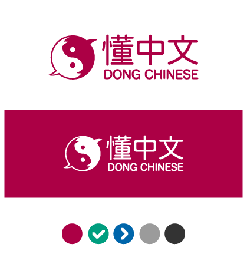
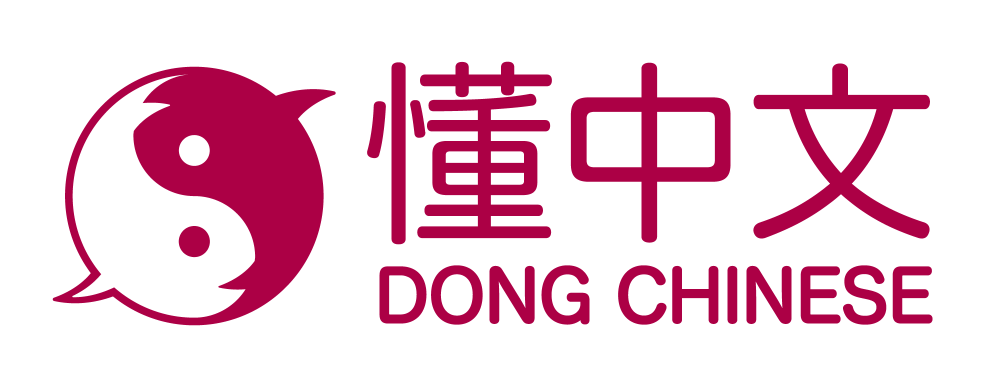
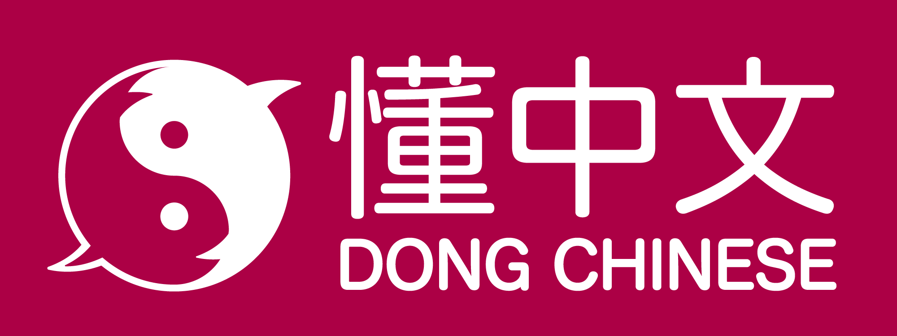

# Dong Chinese Branding

Logos and palette designed by [Ivan Raszl](https://github.com/iraszl)

## Colors

- Primary color (crimson): #ac0045
- Secondary color (blue): #0066ab
- Tertiary color (turquoise): #009e7f
- Light Gray: #9b9b9b
- Dark Gray: #333333

## Icons

## Logos

